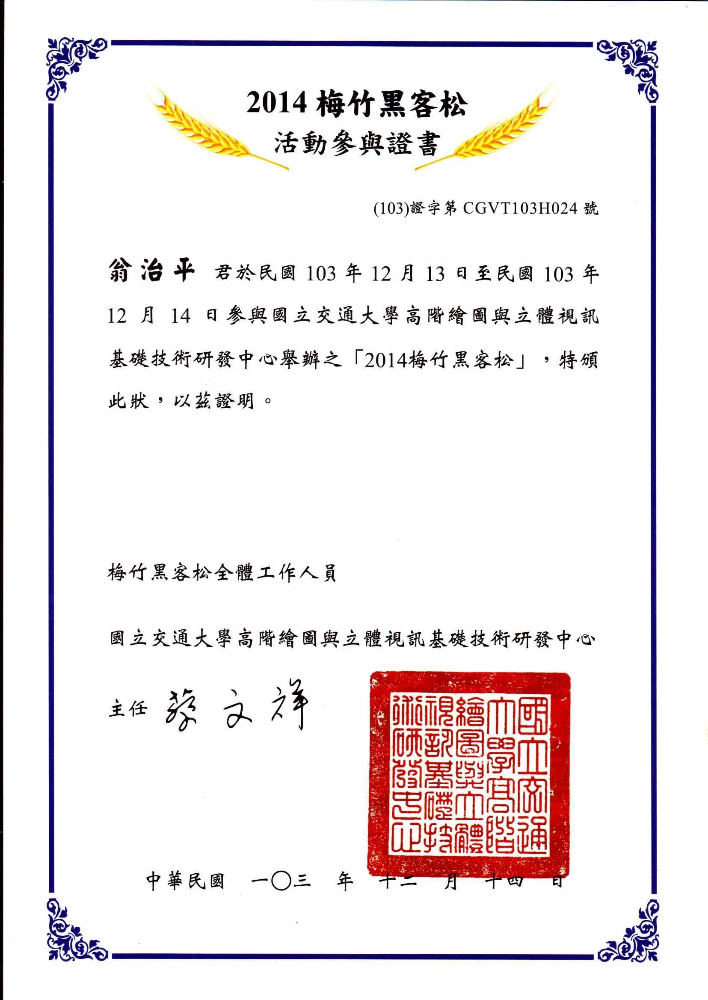
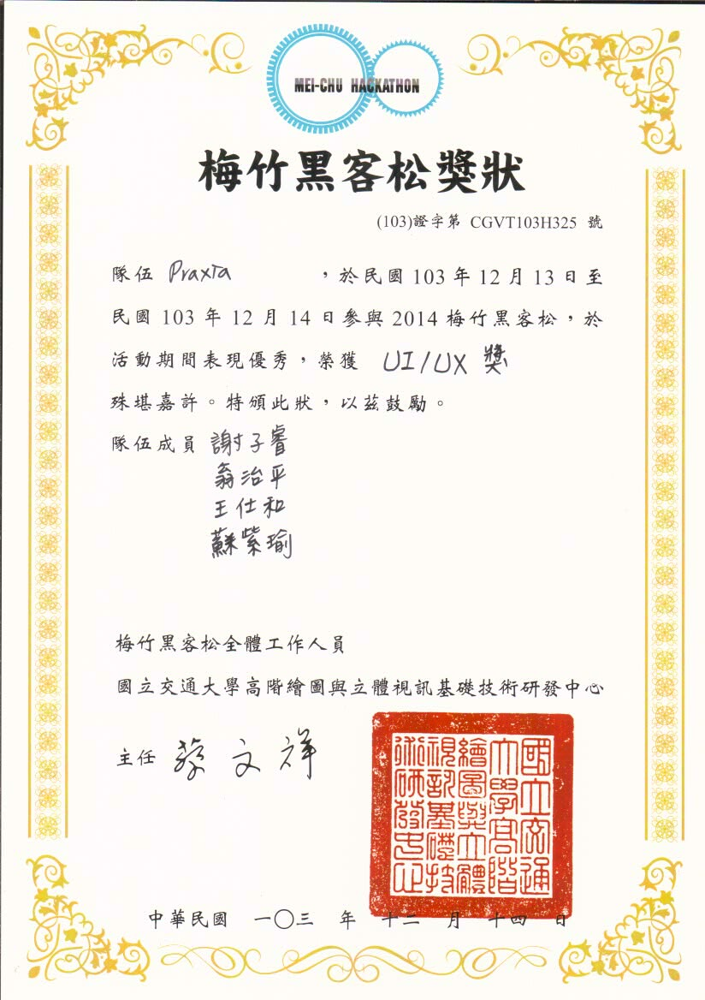
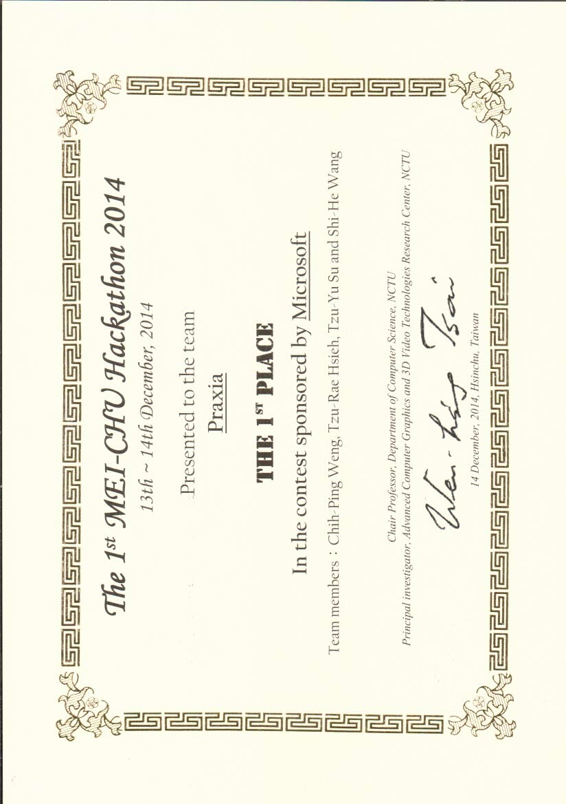
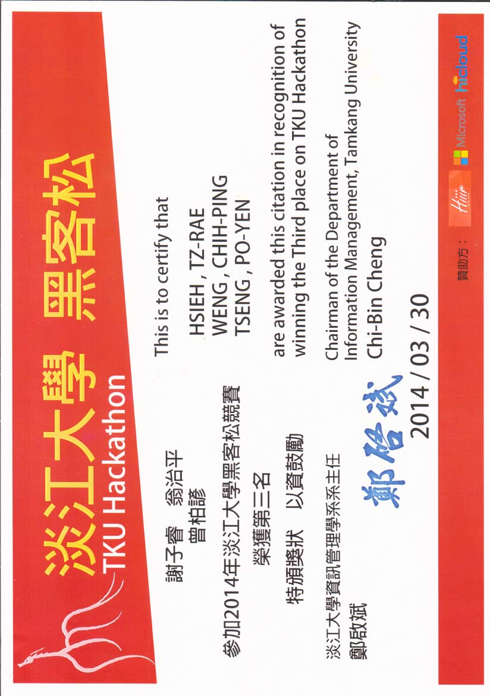
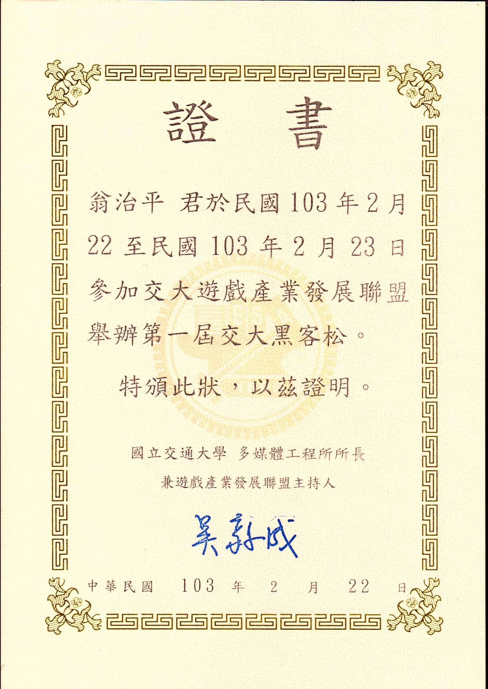
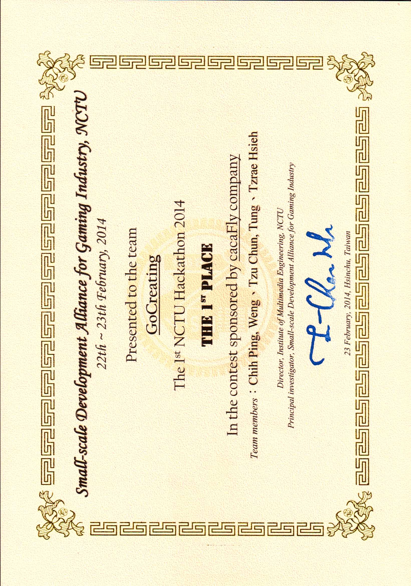

title: 履歷
date: 2016-08-23 22:09:43
---

# 個人簡介

我是一名興趣使然的全端網站開發者，熱愛撰寫網頁，本科系也是資訊工程系。個性有點念舊，卻喜歡帶有變化的生活，興趣是喜歡收集東西，曾經收集過郵票、笑話，~~還有全世界男人都會收集的＊＊~~，現在最喜歡收集朋友的點點滴滴，也許某天會累積成為Big Data吧！

休閒時會看看電影或影集，從美劇、日劇看到韓劇，再從古裝劇、本土劇看到肥皂劇，其實也沒幾部，大概就來自星星的你、甄嬛傳、半澤直樹、痞子英雄、王牌大律師、步步驚心、進擊的巨人、皮諾丘、看見味道的少女、十六個夏天、麻醉風暴、一拳超人、蘭陵王、生活大爆炸、射鵰英雄傳、瑯琊榜、掟上今日子的備忘錄、他們在畢業前一天爆炸、權力遊戲、實習醫生、陰屍路、王牌大醫師、信號、矽谷群瞎傳、絕命毒師這幾部而已。

另外還有一樣超猛收藏品，因為長年受困在新竹這個鬼地方，就隨手把吃過喝過走過玩過愛過痛過恨過的足跡都留在這張[藏寶圖](https://drive.google.com/open?id=1bL2FWXRps9nxrHCMUTmQprpfKKw&usp=sharing)中了！

> 想要我的財寶嗎？想要的話可以全部給你，去找吧！我把所有的財寶都放在那裡了。

# 專長領域

- Full Stack (MERN Stack) Web Development
- Nodejs, Expressjs, Reactjs, Redux, MySQL

# 經歷

#### 「旺仔俱樂部」外包案

- 2015.01-2015.03
- 將原網站後端語言從Asp.net改寫為NodeJs
- 原始網站: <http://www.hotkidclub.com/>
- 改版後網站: <http://115.159.58.20:4000/>

#### 校內開源專案獎學金計畫

- 2014.10-2015.06
- 發起NodeJs Seed Project，協助開發者快速使用Express和Angular架站
- 專案連結: https://github.com/gocreating/seed

#### 校內計算機中心工讀生

- 2014.08-2016.07
- 使用Python和Django撰寫網管系統

#### 「新北市生技產業發展聯盟」外包案

- 2014.06
- 開發新北市生技產業發展聯盟網站後端
- 網站連結: <http://54.249.48.95/>

#### 「隔壁老王的實驗室」新創公司後端工程師

- 2013.09-2013.11
- 開發隔壁老王的實驗室後端網站服務與架構

#### NCHC（國網中心）實習生

- 2013.07-2013.08
- 在ezCloud服務的Admin系統以php實作社群網站登入

# 學歷

#### 國立交通大學

- 2012-2016
- 資訊工程學系網路與多媒體組

#### 國立嘉義高級中學

- 2009-2012

# 成就與事蹟

#### NTU 2B Hackathon MaiCoin公司API優勝獎

- 2015.05
- 開發平台: `NodeJs`、`Android Studio`
- 團隊大小: 2人

#### 梅竹黑客松微軟公司分組冠軍 [^meichu-01] [^meichu-02] [^meichu-03] [^meichu-04]

- 2014.12
- 開發平台: `NodeJs`、`Microsoft Azure`
- 團隊大小: 4人

#### 網頁家教

- 2014.06-2014.08
- 教導兩位學生學習HTML、CSS

#### 淡江黑客松季軍 [^TKU-01] [^TKU-02]

- 2014.03
- 開發平台: `NodeJs`、`MySQL`、`Amazon Web Service`
- 團隊大小: 3人

#### 交大黑客松Cacafly公司分組冠軍 [^NCTU-01] [^NCTU-02]

- 2014.02
- 開發平台: `NodeJs`、`MongoDB`、`Amazon Web Service`
- 團隊大小: 4人

#### 嘉義高中電腦研究社社長

- 2010.06-2011.06

# 技能專長

| 類別 | 技能 |
| --- | --- |
| 程式語言/技術 | `HTML`, `CSS`, `Javascript`, `PHP`, `NodeJs`, `Python` |
| 框架/程式庫 | `Less`, `AngularJs`, `jQuery`, `ExpressJs`, `Django`, `Bootstrap` |
| 樣板引擎 | `EJS`, `Jade` |
| 資料庫/ORM | `MySQL`, `MongoDB` |
| 開發工具/自動化工具 | `Atom`, `Sublime Text`, `Vim`, `Git`, `Gulp` |
| 作業系統/操作平台 | `Linux(Ubuntu)`, `Win 7`, `Win 8`, `Win 8.1`, `Win 10`, `Amazon Web Service`, `Microsoft Azure` |
| 其它 | `React Native`, `Android`, `C/C++`, `Verilog` |

# 作品

- [Express React Hmr Boilerplate](https://github.com/gocreating/express-react-hmr-boilerplate)

  這是一個萬用的`現代應用程式`專案樣板，無論你想開發API Server、React SPA還是React Native，這套樣板都已經幫你設定好環境，也經由我挑選並整合了當前最新潮最受歡迎的Library，詳細技術細節請見Github Repo內的說明。

- [PTT自動洗登入次數](https://github.com/gocreating/ptt-auto-login)

  身為一位PTT忠實愛好者，卻又不想每天手動洗登入次數，只好自幹這個利人利己的工具了，無論是要洗分身賣帳號還是養小號發廢文，這個小作品都是你的最佳選擇。

- 其餘待補上

# 開源專案貢獻

- [strman](https://github.com/gocreating/strman)
  - 2th of total 9+ contributors
  - 說明
    strman是一個專門處理字串的JS Library，當時在Facebook動態牆剛好看到有人分享此專案，也剛好瞄到一個小Bug，就順手發一個PR處理掉了。

- [atom-firepad](https://github.com/gocreating/atom-firepad)
  - 7th of total 7+ contributors
  - [開發日誌](https://fossapc.hackpad.com/A0-Atom-firepad-j2yTwlwy9fi)
  - 說明
    此專案是Atom編輯器的Plugin，由於修了jserv開的自由軟體課程，被迫找一個專案貢獻，就和另外兩位同學一起投入許多心力讓這個Plugin更便利。

- [react-engine](https://github.com/gocreating/react-engine)
  - 5th of total 27+ contributors
  - 說明
    貢獻此專案時，react正剛要起飛，我也積極在尋找與express最相容的react package，`react-engine`是我當時的首選，但是在Windows系統下會有Bug，礙於此Bug造成我自己的專案停滯，於是自己修了Bug，發出這輩子第一次Pull Request。

# 附錄

[^meichu-01]: 
[^meichu-02]: 
[^meichu-03]: 
[^meichu-04]: 
[^TKU-01]: 
[^TKU-02]: 
[^NCTU-01]: 
[^NCTU-02]: 
